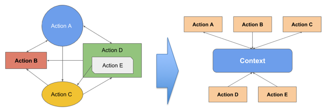

<p align="center">
    <br /><br />
</p>

Lightweight pub/sub module with event backlog, timeout support that maps events to promises and back as well as chains them to other topics. Use it to structure application business logic.

[](https://codecov.io/gh/dimichgh/oja)
[](https://travis-ci.org/dimichgh/oja) [](https://www.npmjs.com/package/oja)
[](http://npm-stat.com/charts.html?package=oja)
[](https://snyk.io/test/github/dimichgh/oja)
[](https://greenkeeper.io/)

# Idea

The main reason for creation of this module is to allow decoupling business logic into smaller isolated standalone components in the application via pub/sub API and/or common context that leads to a simpler/isolated unit testing with easy mocking of input data and easy composition of components into higher async structures.

The context based approach allows a developer to slice the business logic into small, isolated busness actions that communicate to each other via context and that encourages developers to use the same action interface across application code, which makes the code more predictable, easy to define and test with mock data and yes, boring.

# Architecture

## Pub/sub flow

This approach is based on pub/sub interface.
It accumulates events in the backlog for new subscribers. This has pros and cons:

* Allows consumers/producers to be added in any order and guarantees delivery of an event.
* Accumulates events in memory, thus it cannot be used for long running flows as it eventually will run out of memory.
* It is good fit for short request/stream flows that eventually complete and garbage collected.

### Features:

* Queuing events for later consuption. For example, if sonsumer added after the event happened, it would still receive it.
* Consume events as stream/promises.
* Consume stream as events/promises
* Consume promises as stream/events
* Merge promise/streams/events into events/stream/pomises.
* Query the state of the whole flow to see what is still pending and queues states for each topic.
* Set resolution timeout for every topic, upon which it will provide what topic caused the timeout and pending topics.
* Compose/link flows into one.
* Debug/listen to all events going on in the flow.

## Context/business actions

The module provides a way to slice the code into isolated, small and independent actions that can later be used to compose much more complex applications with dependency injection via context object.



# Install

```
npm install oja -S
```

# API

## Flow API

The flow is generic definition of the control flow.

* **Flow**([baseFlow]) creates a flow object
    * *baseFlow* is an optional base flow that would be joined with a new flow.

* **consume**(topics[, callback]) adds a consumer to the flow for the given topic or topics
    * *topics* is one or more topics to capture by the handler
    * **callback**((data|map), flow) is a handler, if provided, it will be called once all topics are resolved
        * *data* resolved for the single topic
        * *map* of resolved data mapped to corresponding topics
        * *flow* is an instance of the flow for convenience
    * **returns** promise or a list of promises if callback is not provided;
        * *promise* for single topic  
        * *promises* mapped to the provided topics

* **consumeStream**(topic[, callback]) returns a readable stream of events for the given topic
    * *Note:* if callback is provided, it will return a stream to the callback(stream) and continue cascading flow by returning 'this' reference;

* **getReader**(topic) returns a reader for a series of events published under given topic.
    * reader.**next()** returns a promise for a single event.
        * The reader reached the end of stream whenever the promise resolves to `undefined`

* **define**(topics[, data|promise|function]) defines a producer for the given topic or an array of topics
    * *topics* is a single topic or an array of topics to broadcast the data with.
    * *data* will be immediately published under the given topics into the flow; in case an error object is passed, the flow will be stopped and an 'error' event will be broadcasted into the flow.
    * *promise* will publish data once resolved; in case of reject, the flow will be stopped and an 'error' event will be broadcasted into the flow.
    * **function**(publisher, flow) will be called immediately
        * *publisher* is a convenience object to publish events for the assigned topic in async use-case
        * *flow* is an instance of the current flow.
        * if *function* returns a non-undefined value, it will be published under the assigned topic immediately; this is useful in a sync flow.

* **on**(topic, callback) adds a listener for the given topic.
* **once**(topic, callback) adds a listener for the given topic that will be called for the fist event.
* **setMaxListeners**(number) allows to increase a limit on how many listeners can be added to the given action, similar to event emitters.
* **catch**(callback) adds an error handler to the flow. If no handlers are registered, it will re-throw the error.
* **timeout**(topics, ms) sets a timeout for the topic or and array of topics. The timeout error will be generated if the topic(s) are not resolved within the specified period of time (in milliseconds)
* **state**() returns a list of topics and their state (topics queue, pending topics)

* **Publisher** API is a convenience object to publish events for the assigned topic
    * **pub**(data|promise)
        * *data* will be immediately published under the given topics into the flow; in case error object is passed, the flow will be stopped and 'error' event will be broadcasted into the flow.
        * *promise* will publish data once resolved; in case of reject the flow will be stopped and 'error' generated.

## Action API

Action type is more specific to business unit that extends Flow further to allow defining executable independent business logic blocks called actions.

While flow starts executing immediately when one defines it, action is activate by calling `execute` method.

The actions can be composed into more complex actions. Once the action is activated, it will implicitly activate all children actions.

Actions cannot be added after they have been started.

* **Action**() is an action constructor

* **add**(action) adds actions to the main action
    * action can be a single action or an array of actions. Action parameter can also be a generic function that accepts flow reference:
* **execute**() is a method called by framework during activation; the action logic should be put into this method
* **activate**() starts the action and all its children. This method better not be overridden or one needs to make sure a base function called.

## Context API

While pub/sub is based on knowledge of topics consumed and published, context based approach provides a more explicit way of what kind actions are available in application.

* createContext(options) - creates a context with actions and properties injected as part of options. It returns a context reference; which provides access to all other actions. It is also a Flow object, so one can mix flow with context. It is recommended to refrain from creating too many Flow/Actions objects and stick to the use of only one - context object - as it is passed everywhere anyways.

# Usage

First we would like you to focus more on how you can apply this module to simplify your business logic with the use of Action type, then you will see Context based examples and then more generic examples on how generic Flow type can be used and applied to the action type as it extends Flow.

## Action

### Execute an action

```js
const Action = require('oja').Action;
new Action().activate();
```

### Execute an action that generates an event

```js
const Action = require('oja').Action;
class MyAction extends Action {
    execute() {
        this.define('foo', 'bar');
    }
}
new MyAction()
    .activate()
    .consume('foo', data => console.log(data)); // will print bar
```

### Composing more complex actions out of basic ones

```js
const Action = require('oja').Action;
class Greet extends Action {
    execute() {
        this.define('greet', 'Hello');
    }
}
// demonstrate generic function instead of action object
function who(flow) {
    // demonstrate re-mapping
    flow.consume('name', name => {
        flow.define('who', name);
    });
}
class Greeting extends Action {
    execute() {
        this.consume(['greet', 'who'], data => {
            this.define('greeting', `${data.greet} ${data.who}`)
        });
    }
}
const helloAction = new Greeting();
helloAction
    .add(new Hello())
    .add(who)
    .activate()
    .define('name', 'World')
    .consume('greeting', console.log); // prints Hello World
```

## Context Action

### Action definition

```js
modules.exports = async context => {
    // action logic here
};
?/ or with parameters separation
modules.exports = context => (arg1, arg2, ...) => {
    // action logic here
};
```

### Action usage

Calling action within other action
```js
modules.exports = context => (keyword, ...) => {
    // we can call other actions via context
    // assuming we define actions domain (see bellow for more examples)
    const results = await context.actions.find(context.keyword);
    return {
        keyword: context.keyword,
        searchResults; results
    }
};
```

Calling the above action, assuming it is called search under domain 'actions'
```js
modules.exports = async context => {
    const searchResults = await context.actions.search('foo'); // passing some parameters
};
```

### Context creation

There are two main components:

* properties are translated into `context.<property name>` access pattern
* functions are translated into `context.<domain>.<action name>`

```js
const createContext = require('oja/context');

// inject/configure context
const context = createContext({
    // injecting properteis
    properties: {
        parameters: {
            foo: 'foov',
            bar: 'barv
        }
    },
    // injection actions
    functions: {
        domainName1: {
            actionName1: context => {}
            actionName2: context => {}
        },
        domainName2: {
            actionName3: context => {}
            actionName4: context => {}
        }
    }
});

// use it
console.log(context.foo); // >> foov
console.log(context.bar); // >> barv

// call action
const actionResult1 = await context.domainName1.actionName1();
const actionResult3 = await context.domainName2.actionName3();
```

Context extends Flow API, hence it allows to mix pub/sub with context based approach

```js
modules.exports = async context => {
    const searchResults = await context.actions.search('foo'); // passing some parameters
    // publish it
    context.define('searchResults', searchResults);
};
// consume it in some other action
modules.exports = async context => {
    const searchResults = await context.consume('searchResults');
    return {
        searchResults
    };
};
```

## Flow

The usage examples are generic and look more like generic event pub/sub mode.

It can be used to create more specific controls like Action mentioned above.

### Simple pub/sub

```js
const Flow = require('oja').Flow;
const flow = new Flow();

// create consumer component
const consumer = flow.consume('foo');
consumer.then(foo => {
    console.log(foo); // prints 'bar'
});

// define producer component
const producer = flow.define('foo');
// publish
producer.pub('bar');
```

### Shorter form for clarity:

```js
// create consumer component
flow
.consume('foo', foo => {
    console.log(foo); // prints 'bar'
})
.define('foo', 'bar');
```

### Consuming multiple events for the given topic

```js
// create consumer component
flow
.consume('foo', foo => {
    console.log(foo); // prints 'bar1' and 'bar2'
})
// generate events
.define('foo', 'bar1')
.define('foo', 'bar2');
```

### Consuming events as a stream

```js
const buffer = [];
// create consumer stream
const stream = flow.consumeStream('foo');
stream.on('data', data => buffer.push(data));
stream.on('end', () => {
    console.log(buffer); // prints one, two, three
})
// generate some data
flow.define('foo', 'one');
flow.define('foo', 'two');
flow.define('foo', 'three');
flow.define('foo', null);
```

### Consuming events via reader

```js
const Flow = require('.').Flow;
const buffer = [];
const flow = new Flow();
// create consumer stream
const reader = flow.getReader('foo');
// generate some data
flow.define('foo', 'one');
flow.define('foo', 'two');
flow.define('foo', 'three');
flow.define('foo', null);

async function read() {
    while(true) {
        const data = await reader.next()
        if (data === undefined) {
            break;
        }
        console.log(data);
    }
}

read();
```

### Consuming multiple topics in one short

```js
// consume multiple topics
flow.consume(['foo', 'qoo'], input => {
    console.log(input.foo);     // prints faa
    console.log(input.qoo);     // prints qaa
});
flow.define('foo', 'faa');
flow.define('qoo', 'qaa');
```

### Using promise

```js
// create consumer component
flow
.consume('foo', foo => {
    console.log(foo); // prints 'bar'
})
.define('foo', new Promise(resolve => {
    resolve('bar');
}));
```

### Multiple consumers, single producer

```js
// create consumer component
flow
.consume('foo', foo => {
    console.log(foo); // prints 'bar'
})
.consume('foo', foo => {
    console.log(foo); // prints 'bar'
})
.define('foo', 'bar');
```

### Chaining actions, mixing, etc.

```js
// NOTE: the order of consume/define does not matter
// create consumer component
flow
.consume('foo', (foo, runtime) => {
    console.log(foo); // prints 'faa'
    runtime.define('qoo', 'qaa'); // can consume and produce new data
})
.consume('qoo', (qoo, runtime) => {
    console.log(qoo); // prints 'qaa'
    runtime.define('woo', Promise.resolve('waa')); // can use async promise
})
// start chain reaction here
.define('foo', 'faa')   
// lets produce multiple events via event emitter
.consume('woo', (woo, runtime) => {    
    console.log(woo); // prints waa
    // define as event emitter
    const roo = runtime.define('roo');
    // simulate async flow with two event emitted
    setImmediate(() => {
        // generate multiple events
        roo.pub('raa1');
        roo.pub('raa2');
    });
})
// validate
.consume('roo', roo => {
    console.log(roo);   // prints raa1 and raa2
})
// consume multiple topics
.consume(['foo', 'qoo'], input => {
    console.log(input.foo);     // prints faa
    console.log(input.qoo);     // prints qaa
})
// can consume inside consume
.consume('foo', (foo, runtime) => {
    console.log(foo);     // prints faa
    runtime.consume('qoo', qoo => {
        console.log(input.qoo);     // prints qaa
    });
    // or
    flow.consume('qoo', qoo => {
        console.log(input.qoo);     // prints qaa
    });
})
// can generate multiple events using pub
.define('doo', publisher => {
    publisher.pub('daa1');
    publisher.pub('daa2');
    publisher.pub('daa3');
    publisher.pub(null);
})
.consume('doo', doo => {
    console.log(doo); // prints daa1, daa2, daa3, null
});
.consumeStream('doo', stream => {
    stream.on('data', console.log) // prints daa1, daa2, daa3
    stream.on('end', () => console.log('end of "doo"'));    
})
// NOTE: we can consume first event via promise if we are not interested in the rest
.consume('doo').then(doo => {
    console.log(doo); // prints daa1
});

// for debug you can listen to all events
flow.consume('*', evt => {
    console.log(`Event type: ${evt.name}, data: ${evt.data}`);
})
```

### Join flows together

```js
const base = new Flow();
base.define('foo', 'bar')
const flow = new Flow(base);
flow.consume('foo', foo => {
    console.log(foo); // prints bar
});
```

You can also make them depend on each other

```js
const base = new Flow();
base.consume('shared', (_, rt) => {
    rt.define('foo', 'bar');
});
const flow = new Flow(base);
flow.consume('foo', foo => {
    console.log(foo); // prints bar
});
flow.define('shared', ''); // trigger the chain
```

### Timeouts

The promise chain may be hard to figure out where it is blocked.
Oja allows to set a timeout for the given topics and upon the timeout would provide an error message listing topics that have not been resolved yet.

```js
flow
.consume('foo')
.consume('bar')
.consume('too')
.timeout(['foo', 'bar'], 300)   // 300 ms
.define('bar', 'boo')
.catch(err => {
    console.log(err.message); // prints "Topic/s (foo) timed out, pending topics (too)"
});
```

### Querying for the state

Oja provides a current status of topcis that have not been resolved

```js
flow
.consume('foo')
.consume('bar')
.consume('too')
.define('bar', 'boo');

console.log(flow.state()); // prints [foo, too]
```

### Error

#### Throwing error

```js
flow.define('error', new Error('Boom'));
// or
flow.define('error', Promise.reject(new Error('Boom')));
// or
flow.define('data', () => {
    return new Error('Boom');
});
// or
flow.define('data', runtime => {
    runtime.pub(new Error('Boom'));
});
```

#### Catching error

```js
flow.catch(err => {
    console.log(err);   // prints Boom if linked to the above flow
});
// Or
flow.consume('error', err => {
    console.log(err);   // prints Boom if linked to the above flow
});
```

#### Error stops flow

The error will prevent further events including error events from publishing.

```js
flow
.define('foo', 'faa')
.define('boo', 'baa')
.define('error', new Error('Boom'))
.define('too', 'taa')
.consume('foo', foo => {
    console.log(foo); // prints faa
})
.consume('boo', foo => {
    console.log(foo); // prints baa
})
.consume('too', too => {
    // will never happen
    throw new Error('Should never happen');
})
.catch(err => { // catch error
    console.log(err);   // print Boom
});
```

#### Composing complex flows

```js
const base = new Flow();
new Foo(base)
```
